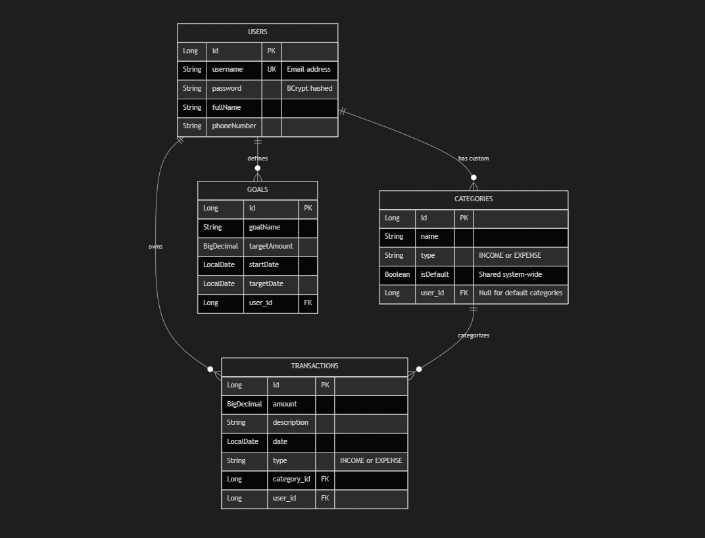
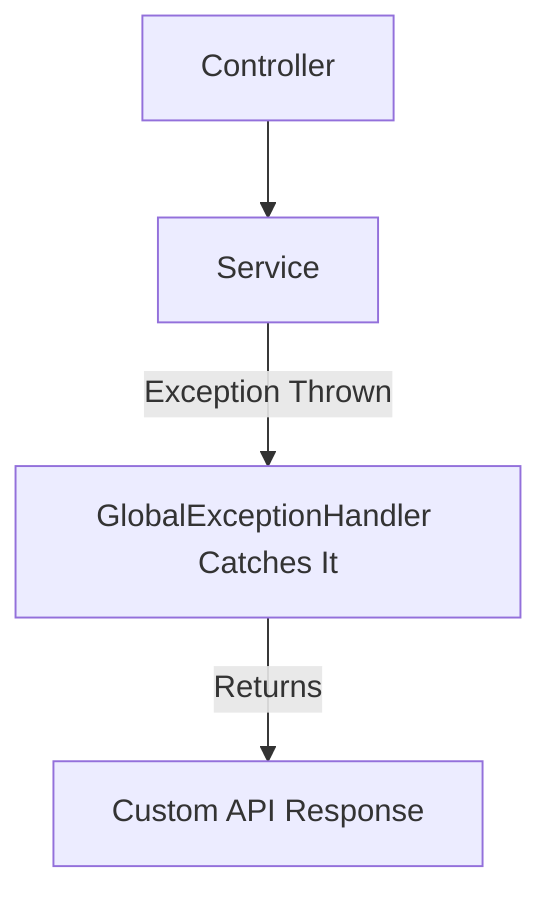
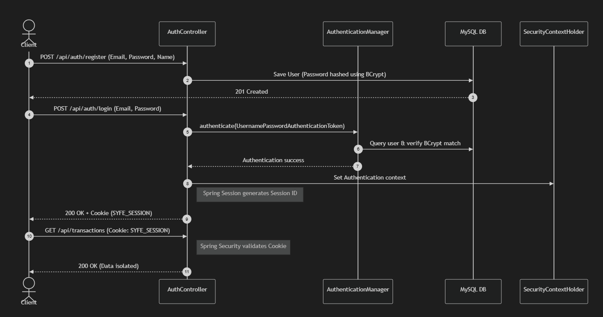

# Personal Finance Manager API

This is a robust, production-ready REST API for managing personal finances, including tracking income/expenses, setting savings goals, and generating financial reports. It is built using Spring Boot 3.x and adheres to a strict layered architecture.

## Setup Instructions

### Prerequisites
- Java 17+
- Maven 3.8+
- PostgreSQL (configuration provided for NeonDB)

### Running the Application
1. **Clone the repository.**
2. **Configure Database**: Update `src/main/resources/application.yaml` with your database credentials (default uses a hosted Postgres instance). 
3. **Build and Run**:
   ```bash
   mvn clean install
   mvn spring-boot:run
   ```
4. **Accessing the API**: The API will be available at `http://localhost:8080`.

### Running Tests
To run the unit tests (which include Controller and Service tests covering >80% of the codebase) and view Jacoco coverage (if configured):
```bash
mvn test
```

To generate JavaDocs for all public classes and methods:
```bash
mvn javadoc:javadoc
```

## API Documentation

### Authentication (`/api/auth`)
- `POST /register`: Register a new user account.
- `POST /login`: Authenticate and start an HTTP session.
- `POST /logout`: Invalidate the current session.

### Categories (`/api/categories`)
- `POST /`: Create a new custom category.
- `GET /`: Retrieve all accessible categories (default + custom).
- `DELETE /{name}`: Delete a custom category.

### Transactions (`/api/transactions`)
- `POST /`: Log a new transaction (income/expense).
- `GET /`: Retrieve transactions with optional filters (`startDate`, `endDate`, `categoryId`, `category`).
- `PUT /{id}`: Update an existing transaction (supports partial updates).
- `DELETE /{id}`: Delete a transaction.

### Savings Goals (`/api/goals`)
- `POST /`: Create a new savings goal.
- `GET /`: Retrieve all goals with dynamic progress tracking.
- `GET /{id}`: Retrieve a specific goal.
- `PUT /{id}`: Update goal target amount or date.
- `DELETE /{id}`: Delete a goal.

### Reports (`/api/reports`)
- `GET /monthly/{year}/{month}`: Generate a detailed monthly summary of income, expenses, and net savings.
- `GET /yearly/{year}`: Generate a yearly summary.

## Design Decisions

- **Architecture**: The application follows a strict `Controller -> Service -> Repository` layered architecture. Controllers handle `HTTP routing and request validation`, Services encapsulate `business logic`, and Repositories manage `database interactions`.
- **Security**: The application utilizes Spring Security with `Session-Based Authentication (Secure Cookies)` rather than JWT. This provides robust `stateful security`.
- **Data Isolation**: All database queries are explicitly tied to the currently authenticated `User` context, ensuring strict cross-tenant data isolation.
- **Partial Updates**: The API allows for partial JSON payloads on PUT endpoints by gracefully handling omitted fields in the service layer without triggering validation errors.
- **Validation**: Global exception handling translates `BusinessRuleException` and validation failures into standardized JSON responses, preventing 500 internal server errors.

---

## Architectural Diagrams

# Database Design


# Exception Handling


# Session-Based Authentication
